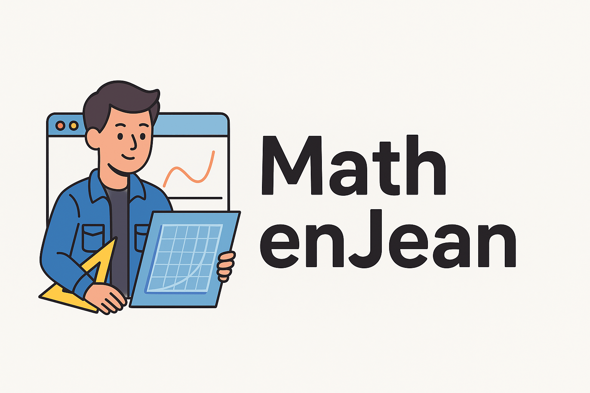

<p align="center">
  
</p>

# 📘 MathEnJean

[🇬🇧 English](#-english-version) | [🇫🇷 Français](#-version-française)

---

## 🌍 English version

### 🎯 Project Goal
This repository contains a project developed as part of **MATh.en.JEANS**, an initiative that introduces students to real mathematical research.  

The code, written in **Python**, provides several tools to:
- 📊 handle and process data (`excel.py`)  
- 🖼️ generate visualizations and graphics (`graphic.py`)  
- 🧮 perform mathematical computations (`main.py`)  
- 📁 store results (`/result`)  

The main purpose is to provide a digital support tool to explore mathematical problems, automate analyses, and make research activities in MATh.en.JEANS workshops more accessible.  

---

### 📚 What is MATh.en.JEANS?
**MATh.en.JEANS** is a French non-profit association that gives young people (middle school, high school, university students) the opportunity to live a genuine **mathematical research experience**.  

#### 🔎 How it works
- A researcher proposes one or more **open research topics**.  
- Volunteer students, supported by their teachers, work in small groups throughout the school year.  
- They experiment, test, make mistakes, and start over — in short, they do mathematics **like real researchers**.  
- Groups from different schools (paired workshops) exchange ideas and regularly meet with the researcher.  
- At the end of the year, they present their findings during a **MATh.en.JEANS conference** and publish an article.  

#### 🏅 Recognition
- Approved by the **French Ministry of Education**  
- Awards: *d’Alembert Prize (1992)*, *La France s’Engage Label (2015)*, *CNRS Medal for Science Mediation (2023)*  

👉 More info on the [official website](https://www.mathenjeans.fr).  

---

### 🚀 Installation & Usage
1. Clone the repository:
   ```bash
   git clone https://github.com/morshey77/MathEnJean.git
   cd MathEnJean

## 🌍 Version français

## 🎯 Objectif du projet
Ce dépôt contient un projet développé dans le cadre de **MATh.en.JEANS**, une initiative visant à faire découvrir la recherche mathématique aux élèves.  

Le code, écrit en **Python**, propose différents outils pour :
- 📊 gérer et exploiter des données (`excel.py`)  
- 🖼️ générer des visualisations ou graphiques (`graphic.py`)  
- 🧮 exécuter des traitements mathématiques (`main.py`)  
- 📁 stocker les résultats (`/result`)  

L’objectif est de fournir un support numérique pour explorer des problèmes mathématiques, automatiser certaines analyses et rendre plus accessibles les démarches de recherche menées dans les ateliers MATh.en.JEANS.  

## 📚 Qu’est-ce que MATh.en.JEANS ?
**MATh.en.JEANS** est une association française qui propose aux jeunes (collégiens, lycéens, étudiants) de vivre une véritable **expérience de recherche mathématique**.  

### 🔎 Le principe
- Un chercheur propose un ou plusieurs **sujets de recherche ouverts**.  
- Des élèves volontaires, encadrés par leurs enseignants, travaillent en petits groupes tout au long de l’année.  
- Ils expérimentent, testent, se trompent, recommencent : bref, ils font des maths **comme de vrais chercheurs**.  
- Les groupes échangent entre établissements jumelés et rencontrent régulièrement le chercheur.  
- En fin d’année, ils présentent leurs résultats lors d’un **congrès MATh.en.JEANS** et publient un article.  

### 🏅 Reconnaissance
- Agréée par le **Ministère de l’Éducation nationale**  
- Distinctions : *Prix d’Alembert (1992)*, *Label La France s’Engage (2015)*, *Médaille de la médiation scientifique du CNRS (2023)*  

👉 Plus d’infos sur [le site officiel](https://www.mathenjeans.fr).  

---

## 🚀 Installation et utilisation
1. Cloner le dépôt :
   ```bash
   git clone https://github.com/morshey77/MathEnJean.git
   cd MathEnJean
